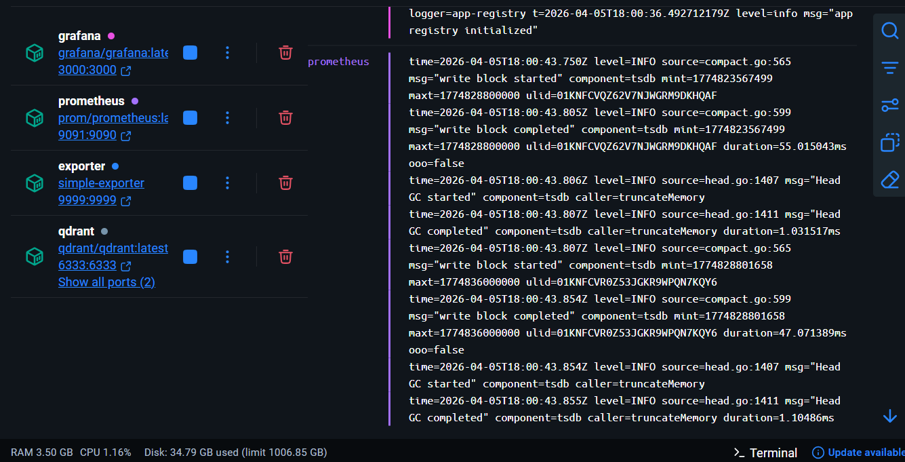
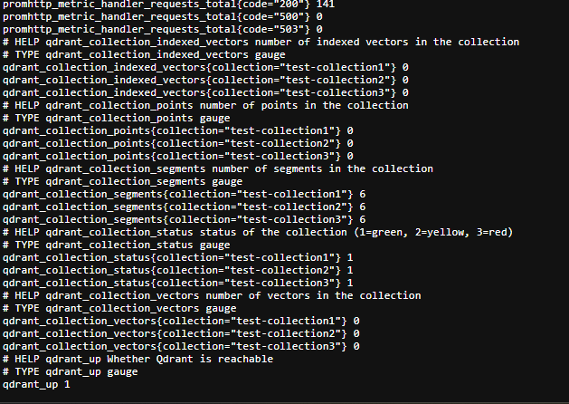
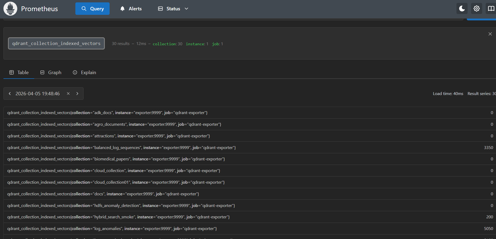
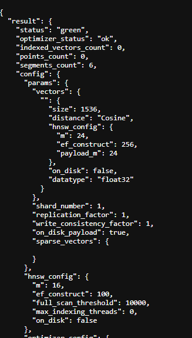

<div align="center">


<h1>Qdrant Exporter</h1>

<p>
  <a href="https://opensource.org/licenses/MIT"></a>
  <a href="https://github.com/Goodnight77/qdrant-exporter/commits/main"></a>
  <a href="https://github.com/Goodnight77/qdrant-exporter/stargazers"></a>
  <a href="https://discord.gg/qdrant"></a>
</p>

<p>
    ✨ A simple Prometheus exporter for Qdrant vector database that exposes per-collection metrics and enhances monitoring. ✨
</p>

</div>

---

<div align="center">
  <h3>
    <a href="#what-it-does">Features</a> |
    <a href="#how-to-run">Quick Start</a> |
    <a href="#available-metrics">Metrics</a> |
    <a href="#python-sdk">Python SDK</a> |
    <a href="#troubleshooting-important">Help</a>
  </h3>
</div>

A simple Prometheus exporter for Qdrant vector database that exposes per-collection metrics.

## What it does

- scrapes the Qdrant API for collection data
- exposes exporter metrics at `/metrics`
- works with Prometheus and Grafana

## Supported Qdrant modes

- local Qdrant in Docker: supported
- local Qdrant running on your host: supported
- Qdrant Cloud: supported if `QDRANT_URL` and `QDRANT_API_KEY` are set

The app reads:

- `QDRANT_URL`
- `QDRANT_API_KEY`

If `QDRANT_API_KEY` is present, the exporter sends it as the `api-key` header.

## How to run

### Local Qdrant mode with Docker



From the `simple/` folder:

```bash
set -a
source .env.local
set +a
docker compose --profile local up -d --build
```

Use this mode when you want the exporter to talk to the local Qdrant container.

You can also use:

```bash
make local
```

This starts:

- `qdrant`
- `exporter`
- `prometheus`
- `grafana`

### Qdrant Cloud mode with Docker

Then start the stack without the local Qdrant profile:

```bash
set -a
source .env.cloud
set +a
docker compose up -d --build
```

This mode uses the cloud values from `.env.cloud` and does not start the local Qdrant container.

You can also use:

```bash
make cloud
```

This starts:

- `exporter`
- `prometheus`
- `grafana`

### Run the exporter against Qdrant Cloud

If you want to use Qdrant Cloud, set these values in `.env` or your shell before starting the exporter:

- `QDRANT_URL` to your Qdrant Cloud endpoint
- `QDRANT_API_KEY` to your Qdrant Cloud API key

```bash
set QDRANT_URL=https://your-cluster-url
set QDRANT_API_KEY=your_api_key
go run .
```

If you run the Docker stack instead, make sure the exporter container also receives those same variables.

If you want to use the cloud setup, do not enable the `local` profile. That keeps the Qdrant container out of the stack.

## Metrics endpoint

Visit:

- [Exporter metrics](http://localhost:9999/metrics)



Example metrics:

```text
# HELP qdrant_up Whether Qdrant is reachable
# TYPE qdrant_up gauge
qdrant_up 1
```

## Available metrics
#### prometheus metrics example 


- `qdrant_up` - whether the exporter can reach Qdrant, `1` for up and `0` for down
- `qdrant_collection_points{collection}` - number of points in each collection
- `qdrant_collection_vectors{collection}` - number of vectors in each collection
- `qdrant_collection_indexed_vectors{collection}` - number of indexed vectors in each collection
- `qdrant_collection_segments{collection}` - number of segments in each collection
- `qdrant_collection_status{collection}` - collection status mapped to a number: `1` green, `2` yellow, `3` red, `0` unknown

## Prometheus ports

These ports are different because there are two Prometheus views:

- `http://localhost:9091` is the **host-mapped Prometheus UI** from Docker Compose
- `http://localhost:9090` is the **container’s internal Prometheus port**

In this project, you should use:

- [Prometheus graph](http://localhost:9091/graph)
- [Prometheus targets](http://localhost:9091/targets) (to check health/state)
- [Prometheus metrics](http://localhost:9091/metrics)

## Grafana access

- [Grafana UI](http://localhost:3000)
- default credentials: admin / admin


first, add Prometheus as a data source:

1. login to Grafana
2. go to Configuration → Data Sources → Add data source
3. select Prometheus
4. set URL to `http://prometheus:9090` (this is the internal docker network name)
5. click "Save & Test" - you should see "Data source is working"

then import the pre-built dashboard:

1. go to Dashboards → Import
2. upload `examples/grafana-dashboard.json`
3. the dashboard should automatically use the Prometheus data source
4. click "Import"

The dashboard will show charts for your qdrant collection metrics.

Why you may not see the new Qdrant metrics immediately:

- `[Prometheus metrics](http://localhost:9091/metrics)` shows Prometheus' own internal metrics, not the exporter’s custom `qdrant_*` metrics
- the exporter’s custom metrics are exposed at [http://localhost:9999/metrics](http://localhost:9999/metrics)
- Prometheus only stores what it scrapes from the exporter, so query the metric names in [Prometheus graph](http://localhost:9091/graph) after the scrape runs
- if the exporter is not reachable from Prometheus, check [Prometheus targets](http://localhost:9091/targets) first

If Prometheus is running in Docker Compose, it should scrape `exporter:9999`, not `localhost:9999`.
`localhost` inside the Prometheus container means the Prometheus container itself, not the exporter container.
Use `http://localhost:9999/metrics` in your browser, but Prometheus must use `http://exporter:9999/metrics` on the Docker network.

If you want to confirm Prometheus is scraping the exporter correctly, check:

- [Prometheus targets](http://localhost:9091/targets)

## Qdrant data persistence

- Qdrant data is stored in the named Docker volume `qdrant-storage`
- collections survive `docker compose up -d` and `docker compose down`
- collections are lost if the volume is deleted, for example with `docker compose down -v`
- the local Qdrant container only starts when you use `source .env.local` and `docker compose --profile local up -d --build`

## Python SDK
**note:** this SDK connects to the Go exporter service, so the exporter needs to be running first.



The Python SDK reads the exporter metrics endpoint directly, so it stays in sync when you add new metrics in Go.

### Install

```bash
python -m pip install -r requirements.txt # for dev/test just to install pytest
python -m pip install -e .
```

### Usage

```python
from python_exporter import ExporterClient

client = ExporterClient("http://localhost:9999")

print(client.metric_names())
print(client.get_value("qdrant_up"))
print(client.get_samples("qdrant_collection_points"))
print(client.get_value("qdrant_collection_points", {"collection": "aaaaa"}))
print(client.to_json())
```

### What it gives you

- metric names from the exporter
- values for any metric the exporter exposes
- labeled collection metrics without hardcoding each one
- automatic support for future exporter metrics

### Live test

If the exporter is already running, you can test the Python SDK against it with:

```bash
set EXPORTER_URL=http://localhost:9999
python -m pytest tests/test_live_exporter_sdk.py -m integration
```

If you just want to print the exporter output without pytest:

```bash
set EXPORTER_URL=http://localhost:9999
python tests/inspect_exporter.py # inspect first 5 collections 
```


## troubleshooting (important)
### local vs cloud confusion
if local didnt work check those it might that the env still have the qdrant credentials
```shell
docker compose logs exporter
docker compose exec exporter sh -lc 'echo $QDRANT_URL'
docker compose exec exporter sh -lc 'wget -qO- http://qdrant:6333/collections'
```

#### Expected for local mode:

  - QDRANT_URL should be http://qdrant:6333
  - wget .../collections should return JSON or at least connect

### docker compose down didnt work
```shell
# if you got smthg like ! Network simple-net  Resource is still in use                                              0.0s 

docker compose ps
docker stop NameOfTheContainer
docker compose down
```

### Useful commands

```bash
docker compose ps
docker compose logs qdrant
docker compose logs exporter
```

## Author 
[Mohamed Arbi Nsibi](https://www.linkedin.com/in/mohammed-arbi-nsibi-584a43241/)