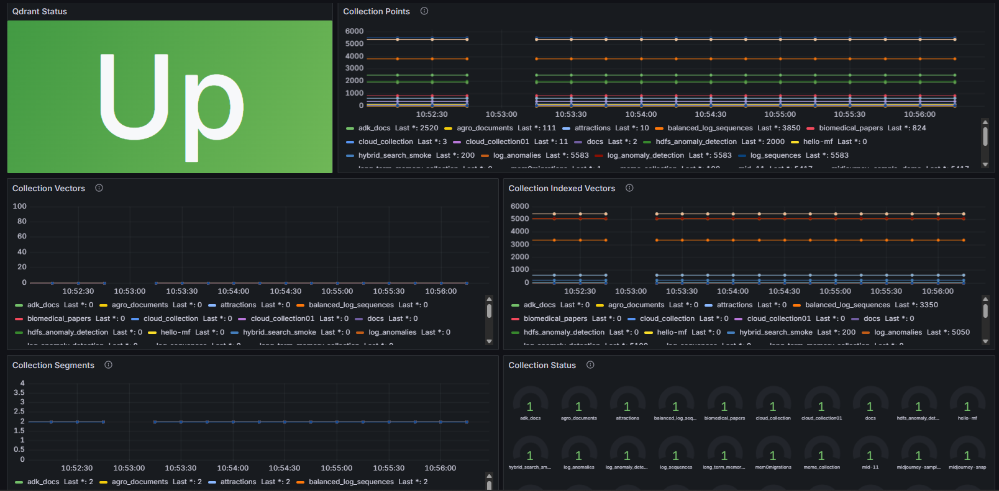

# Roadmap

This project currently exports the core Qdrant collection metrics.

## Next metrics to add

- collection shard counts
- collection replica counts
- collection payload schema details
- collection memory usage
- scrape error counters
- last successful scrape time

## Nice-to-have later

- query latency metrics
- per-collection status breakdowns
- cluster health summaries
- richer labels for shard and replica state

## Current metrics

- `qdrant_up`
- `qdrant_collection_points{collection}`
- `qdrant_collection_vectors{collection}`
- `qdrant_collection_indexed_vectors{collection}`
- `qdrant_collection_segments{collection}`
- `qdrant_collection_status{collection}`
### Simple Grafana dashboard

